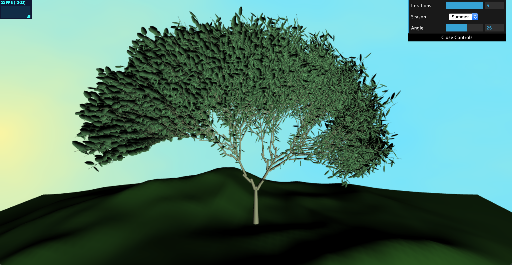
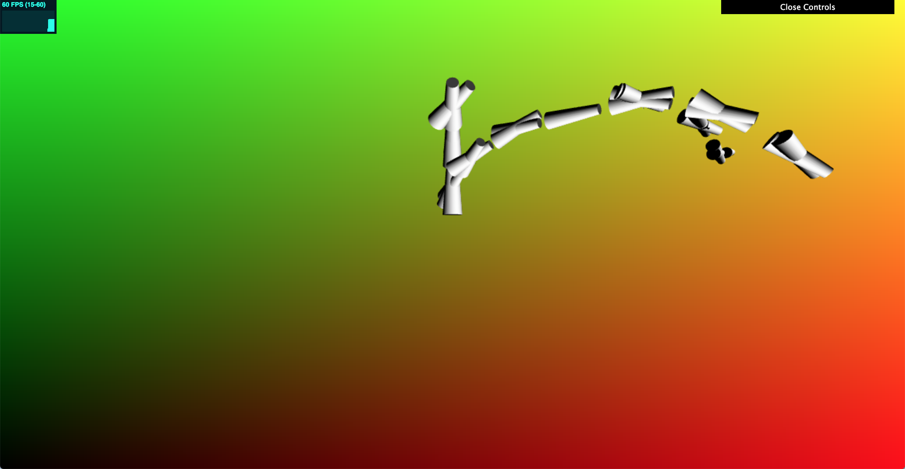
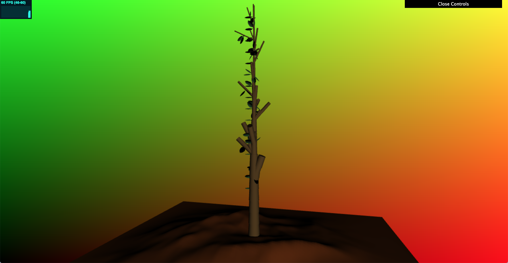
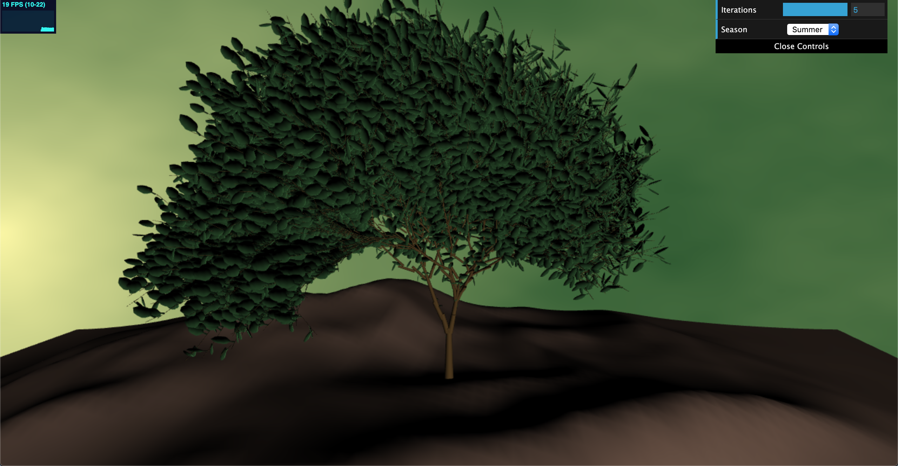
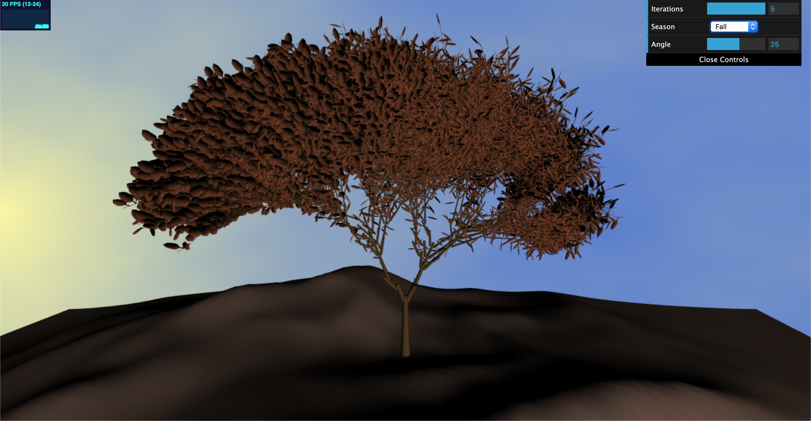
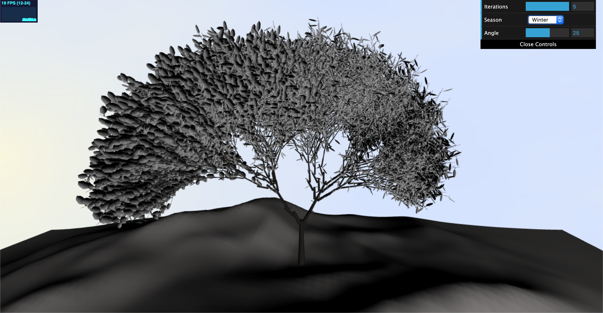
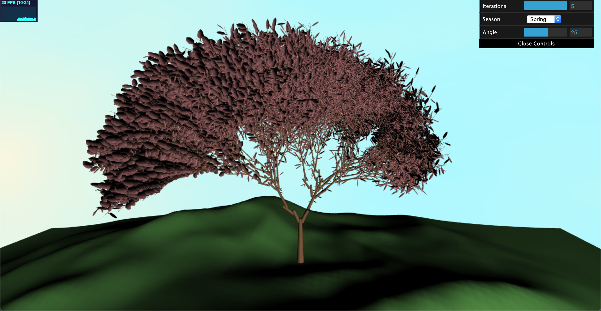

# L-systems
Name: Crystal Lee

PennKey: leecr

Email: leecr@seas.upenn.edu

[Website](crystaljlee.com)

## Live Project Demo
[Link](https://leecr97.github.io/l-systems/)

## Project Description
This project is a procedurally generated tree using an L-System program. It uses a set of formal grammar rules to expand and represent the L-System. The project also makes extensive use of instanced rendering to pass necessary transform data from the CPU to the GPU for more efficient rendering.

An L-System is a parallel rewriting system and a type of formal grammar. It typically consists of an alphabet of symbols that can be used to make strings, a collection of expansion rules that expand each symbol into a different string of symbols, an initial "axiom" string from which to behin construction, and a mechanism for translating the generated strings into geometric structures.

L-Systems commonly make use of a "Turtle" data structure to assist in drawing. The instructions used to draw an expanded axiom can be interpreted as commands for moving and rotating a Turtle, the position of which will be used to draw our geometric structures. Similarly, a stack of Turtles can also be used to save and restore positions of Turtles, which allows for natural-looking branching.

The details of my L-System:

The axiom that I used: 
"FFFFFFFFFX".

The grammar used to expand the axiom: 
"X" ->"FFFL[+FFFL+FFFL-FLF=FLFX[X[XL]]FFFFL_FFXL][-FFLF~F*FFLX[X[XL]]]L"

The drawing rules used to interpret the expanded axiom:
"F" -> Scale our current Turtle down by a small amount, move forward, and create a Branch.
"L" -> Create a Leaf at our current Turtle's position.
"[" -> Push our current Turtle onto the stack.
"]" -> Pop a new Turtle from our stack.
"+" -> Rotate our current Turtle a positve amount around the forward axis. The amount is the specified angle plus a small randomly determined offset.
"=" -> Rotate our current Turtle a positive amount around the up axis.
"~" -> Rotate our current Turtle a positive amount around the right axis.
"-" -> Rotate our current Turtle a negative amount around the forward axis.
"_" -> Rotate our current Turtle a negative amount around the up axis.
"*" -> Rotate our current Turtle a negative amount around the right axis.

Instanced rendering is used to efficiently render meshes that are repeatedly used, such as my branch mesh and leaf mesh. Instead of calculating the transformations of each vertex on the CPU side, I instead load up the vertices of my mesh only once, and then send a transformation matrix for each instance of the geometry to the shaders so the transformations can be applied on the GPU side. This allows for much better performance. All branches are instanced from a single mesh, and all the leaves are instanced from another. The dirt is the only non-instanced mesh, as it is only drawn once in our scene.

The background is textured using procedural noise functions to look like a natural-looking sky. The color of the background at every point is calculated using Fractal Brownian Motion of a simple 2D noise function.

Additionally, there is also a provided GUI that allows the user to modify certain aspects of the scene. These include the number of iterations used to expand our L-System and the angle used to draw our branches. The scene can also be displayed to look like any of the four seasons, with the above image demonstrating the "Summer" look.

Click on the live demo to see it in action!

## Images

First attempt at instance rendering my meshes

First attempt at creating a tree (L-System was not expanding correctly)

Refined tree

Fall look

Winter look

Spring look

## References
[L-Systems](https://cis700-procedural-graphics.github.io/files/lsystems_1_31_17.pdf) slides for CIS 700 class

[The Algorithmic Beauty of Plants](http://algorithmicbotany.org/papers/abop/abop-ch1.pdf)

[OpenGL Instanced Rendering (Learn OpenGL)](https://learnopengl.com/Advanced-OpenGL/Instancing)

[OpenGL Instanced Rendering (OpenGL-Tutorial)](http://www.opengl-tutorial.org/intermediate-tutorials/billboards-particles/particles-instancing/)
